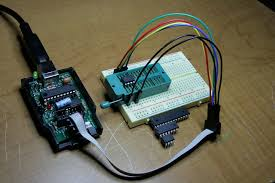
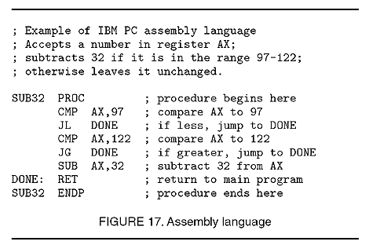
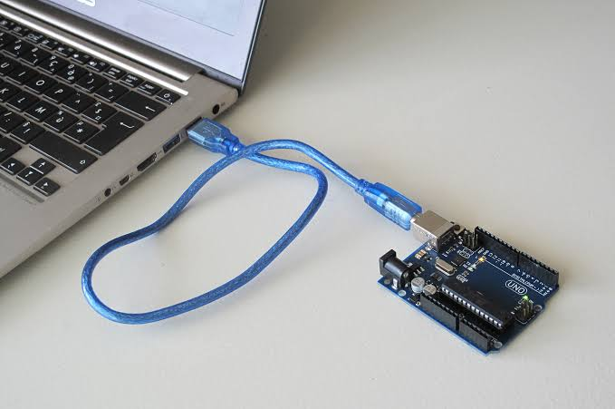

# Aula 1 - Arduino, tipos, instalação da IDE

## Conteúdo

Nesse semestre faremos alguns projetos com arduino que nos fornece um eco-sistema completo para trabalhar com microcontroladores, ele eh um projeto opensource feito por uma empresa italina, mas hoje ja temos outras fabricamentes no mercado que fazem placas similares ja que os modelos de hardware sao abertos e podem ser replicados sem maiores implicacoes. Um arduino não é simplesmente um micro-controlador, ele é uma placa de desenvolvimento que tem um micro-controlador e algumas outras peças que facilitam nosso trabalho, para programar micro-controladores "na mão" é bem mais complexo, pois precisamos geralmente montar um cirucuito e ter algumas ferramentas mais especificas, e o arduino facilita isso para nós.

Sem o arduino:

Com arduino:

O Arduino pode ser alimentado por uma fonte de 9v ou um cabo serial-usb(brotip: muitas impressoras usam esse cabo). A fonte geralmente é usada quando o projeto está em funcionamento mesmo(a fonte tambem pode ser substitudida por baterias...) e o cabo serial é usado para transferência de dados. O Arduino usa C++ como linguagem padrão, mas existem alternativas(mais sombrias, diga-se de passagem), porém focaremos no C++!
O arduino tem alguns pinos(a quantidade muda de acordo com o modelo), esses pinos servem para fazer conexões baseadas em input e output.

Temos os pinos analógicos, que são prefixados com um A maiusculo, ex: `A1`, onde seus valores variam de 0 a 1023, temos também pinos digitais, que são representados apenas por números, ex: `13`, e os pinos prefixados com `~` são pinos PWM, que sao pinos digitais que simulam um sinal analógico(veremos mais sobre isso na aula de eletronica basica). Também temos os pinos de alimentação como `3.3v`, `5v` e `GND`(Ground) e `Vin` que tem basicamente a mesma tensao de entrada do arduino, tambem temos os pinos `RX` e `TX` que servem para receber e enviar dados via serial, entre [outros](https://www.arduino.cc/en/reference/board) que veremos no decorrer das atividades.

Esse eh o esquema de pinagem do arduino uno:

Temos uma gama enorme de modelos dispoíveis, entre eles muitos que não são da empresa Arduino propriamente dito. Abaixo vou listar alguns modelos e citar algumas caracteristicas:

* Arduino Uno - O mais conhecido de todos, ele é um modelo bem simples e barato, e muito indicado para quem está começando, porém não tem muitos recursos especiais mas tem uma quantia razoavel de pinos, nos usaremos ele em quase todos nossos projetos.

* Arduino Mega - Um dos maiores modelos, com mais de 70 pinos dispoíveis, esse modelo é muito usado em impressoras 3D, cortadoras a laser e CNC's.

* Arduino mini / pro micro - Esses dois modelos são bem conhecidos pelo seu tamanho, são bem pequenos e geralemnte usados para projetos mais discretos, como o Rubber Ducky, teclados mecânicos, etc.

* Esp32 / Esp8266 - Esses modelos não são da empresa Arduino, eles se destacam por seu tamanho pequeno e pela quantidade enorme de recursos que já vem embutidas e não precisam ser compradas a parte, como o módulo de wifi, bluetooth, 520 KiB SRAM de memória(o que é mais que alguns arduinos), porém o upload do código para a placa é um pouco mais chatinho e algumas coisas funcionam um pouco diferente de arduinos convencionais, então sempre que usar um ESP verifique se a lib que tu usará suporta o seu dispositivo.

Um termo muito comum também de se ouvir é `SHIELDS`, shields são módulos que se conectam ao arduino para fazer algo como abaixar a tensão de um circuito, controlar um motor, etc.

Agora que já entendemos o básico do funcionamento do arduino vamos falar um pouco sobre a IDE(Integrated Development Environment) do Arduino. Primeiro instale ela em sua máquina, acesse [esse link](https://www.arduino.cc/en/main/software) e faça o download de acordo com seu sistema operacional.

Para nós as principais funções são:

* File -> Examples: Possui diversos exemplos para se inspirar.

* Sketch -> Add library: Instalar uma lib na sua máquina.

* Tools -> Board: Para escolher qual placa você está usando.

* Tools -> Serial Port: Escolhe a porta usb do computador que está ligado a porta serial do arduino, no linux o padrão de nomenclatura para esse dispositivo é algo assim: `dev/ttyACM0`, e para windows `COM1`.

* Tools -> Auto Format: Identa seu código corretamente.

* Botão verify: Compila seu código para saber se tem algum erro mas não envia para a placa.

* Botão upload: Compila seu código e envia para a placa.

Apos fazer o upload de um codigo podemos acompanhar a comunicacao que acontece usando o monitor de porta serial que nos mostra as informacoes em formato numerico/texto ou o serial plotter, que exibe os mesmos dados em forma de grafico.

SHIELDS

## Referencias e recursos uteis

[site oficial do arduino](arduino.cc/)

[Esquema eletrico do arduino](https://www.arduino.cc/en/uploads/Main/arduino-uno-schematic.pdf)

[Arduino Download](https://www.arduino.cc/en/Main/Software)

[Pinagem do arduino](https://www.arduino.cc/en/reference/board)

[Comparacao de modelos de arduino da sparkfun](https://www.youtube.com/watch?v=hjRSwBcLcSU)
