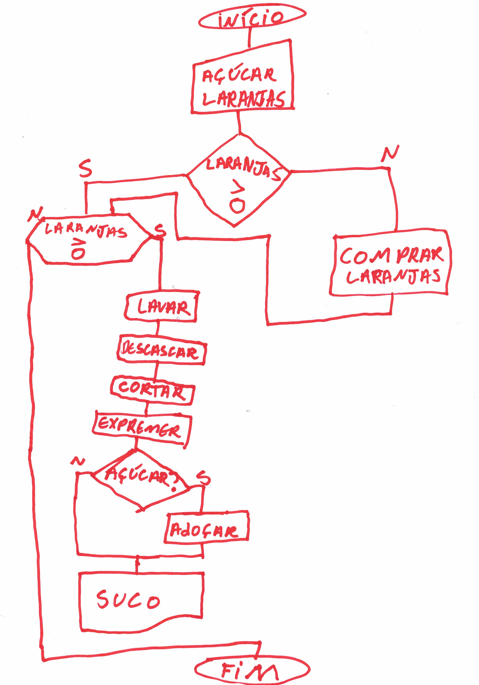
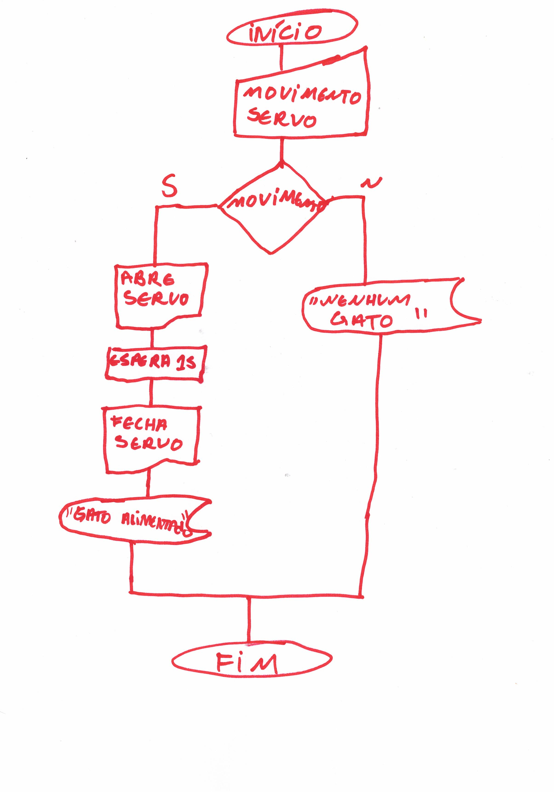

# Aula 2 - Introdução à lógica da programação

## Lógica da programação

O primeiro passo para se aprender a programar é desenvolver um pensamento lógico. Todos os dias usamos a lógica (mesmo sem perceber),
como em situações em que é preciso tomar qualquer decisão. Você pensa sobre aquilo e procura achar a melhor solução, correto? É exatamente este mesmo processo que faremos para criar nossos programas. Sempre que temos algo a fazer, passamos por basicamente duas etapas:

- Descobrir o que de fato precisamos fazer

- Criar uma maneira de realizar tal tarefa

No caso da programação, é possível utilizarmos o mesmo raciocínio: primeiro precisamos entender o problema para, num segundo momento, procurar a melhor solução. Uma característica interessante sobre a lógica é que, por termos várias formas de solucionar um mesmo caso, sempre podemos lidar com diversas possibilidades diferentes de respostas, não havendo de fato uma resposta absoluta. Porém, apesar de lidarmos com diferentes possíveis soluções, nem todas elas serão corretas para determinado problema a ser resolvido.

Entre as diferentes formas de solucionarmos um problema, sempre haverá como opções: a maneira mais rápida de chegarmos ao objetivo final (e que, apesar de não ser a melhor das escolhas, resolverá nosso problema) ou a solução ideal para a questão que temos em aberto no momento (mas que, em muitos casos, possa ser mais demorada). Não há uma escolha correta, sempre teremos que avaliar se o contexto nos pedirá uma solução mais rápida ou mais complexa. Claro que, quanto mais clara, limpa e performática for a solução que encontramos, melhor será o resultado obtido, mas, muitas vezes, infelizmente não possuímos o tempo necessário.

Muitas pessoas “colocam as carroças na frente dos bois” quando estão aprendendo a programar, já pulando direto para as linguagens de programação, a leitura de manuais ou procuram entender a sintaxe dos comandos. Porém, posso afirmar com certeza que iniciar dessa forma é como construir um prédio de cima para baixo, pois todas as linguagens de programações que são consideradas `turing complete` utilizam a mesma base lógica, apesar da maneira de escrever ser um pouco diferente entre elas.

O termo turing complete tem sua origem no nome do matemático e pioneiro em lógica de programação Alan Turing, que inventou a máquina de
turing, capaz de resolver diversos problemas matemáticos (caso você a soubesse programar). A ideia básica é que essas linguagens devem oferecer recursos como controles condicionais e de repetição, além de serem capazes de ler algum tipo de dado armazenado, como as variáveis. Por exemplo: C, C++, Ruby, Python, Perl, Clojure, entre muitas outras, são turing complete. Já outras linguagens de marcação, como o HTML e o MARKDOWN (linguagem com a qual esse documento foi escrito), não são turing complete, pois não nos oferecem tais recursos.

## Algoritmos

Não podemos falar de programação sem falar de algoritmos, pois um algoritmo nada mais é do que uma sequência finita de regras e operações. Para nós, muitas vezes, algumas coisas simples do dia-a-dia se tornam automáticas, nos fazendo esquecer de todos os passos que são necessários para se chegar a tal resultado. Este simples fato de nos valermos de nossa intuição para agir sobre aquilo que temos a fazer, podendo até soar como "algo já implícito" em nós, não pode ser comparado ao raciocínio realizado por um computador, que simplesmente fará o que lhe for ordenado.

É por este motivo que, quando começarmos a desenvolver, teremos sempre que pensar da maneira mais detalhada possível. Sendo assim, é importante que os nossos algoritmos sejam sempre bem planejados, e que cubram o maior número de casos possíveis, caso isso seja viável.

Por exemplo: imagine que você quer um suco de laranja. O que você faria para consegui-lo? Neste caso, cada passo necessário até a chegada ao produto final seria uma etapa do seu algoritmo. Em programação lógica, essa é a parte mais importante de todas, pois, entendendo esta lógica, será possível entender praticamente todas as linguagens de programação. Entendendo a lógica, a sintaxe se tornará o menor dos seus problemas.

## Diagrama de blocos

O `Diagrama de blocos`, ou em ingles `Sequential function chart(SFC)`, é uma linguagem de programação gráfica, que apresenta todas as operações que precisamos para considera-la um turing complete. A ideia consiste em criar o desenho para o fluxo de uma função, ou um pedaço de código do nosso programa. Contextualizando de forma geral, a ideia é que, baseados em uma `entrada`, faremos um `processamento` e teremos uma `saída`.

As etapas representadas podem ser descritas por desenhos que são ligados por fios. O diagrama de blocos não possui símbolos para alguns casos específicos, como ler e escrever em sensores. Por isso, para os próximos exemplos, usaremos o símbolo de entrada manual para representar a leitura de sensores e a saída em impressora para representar algum output que não seja apresentado em telas.

Confira a imagem a seguir com os principais símbolos:

Podemos representar nosso problema, referente ao suco de laranja, de diversas maneiras, como no simples exemplo abaixo:

Porém, se partirmos dessa análise, para esse algoritmo funcionar de fato precisaremos adicionar várias outras etapas. A este processo damos o nome de `granularidade` pois, quanto mais `granular` nosso sistema for, maior será sua capacidade de lidar com diferentes eventos e problemas.

No exemplo anterior, poderíamos adicionar mais granularidade apenas descrevendo melhor como compraríamos as laranjas pra o suco, como iríamos de casa até o mercado, como escolheríamos as frutas. Todas essas informações afetariam nosso algoritmo final.

Para ilustrar melhor, vamos ver como ficará o diagrama de blocos do projeto pet feeder. A ideia inicial é bem simples: se detectarmos qualquer movimento perto do dispositivo, ativaremos um motor que abrirá o mecanismo para liberar uma quantidade de ração de um compartimento e que, após um período programado de tempo aberto, será novamente fechado pelo motor.

Claro que se trata aqui apenas de um racunho, e é por isso que essa ideia deve ser melhorada. Seria interessante haver outros tipos de validações e monitoramentos, mas vamos começar de uma maneira simples para depois evoluirmos a ideia. Quem sabe podemos colocar, por exemplo, um intervalo de tempo mínimo entre as alimentações, evitando assim alarmes falsos e desperdícios.

## Desafio

### User story

Seu time começará a projetar um protótipo de solução para automatizar hortas domésticas, e você deve se reunir com seu grupo e planejar qual será a lógica desse projeto. Os requisitos para o projeto são:

* A solução deve medir a umidade do solo, a luminosidade, a temperatura e a umidade do ar;

* Caso o solo esteja muito seco, deveremos irriga-lo;

* Não poderemos ativar a irrigação caso haja um nível de luminosidade muito alto, pois isso queimaria nossas plantas.

### Tasklist

* [ ] Fazer o diagrama de blocos para o problema descrito acima, discutindo a melhor solução com seu squad.

## Referências e recursos úteis

[Video do Computerphile sobre maquina de turing](https://www.youtube.com/watch?v=dNRDvLACg5Q)

[Artigos sobre SFC](https://www.sciencedirect.com/topics/computer-science/sequential-function-chart)
