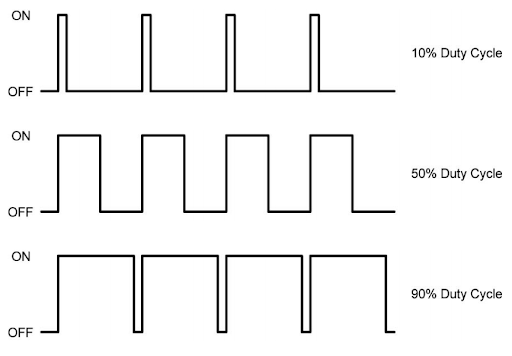
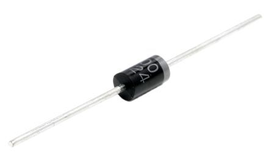
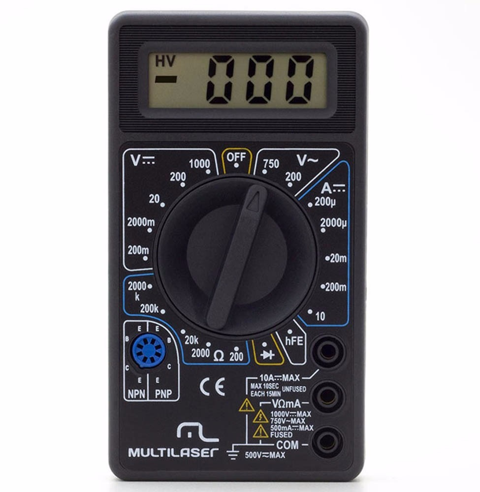

# Aula 3 - Eletronica basica.

## ELETRONICA VS ELETRICA

Nessa aula falaremos um pouco sobre eletronica basica, mas primeiro vamos entender a diferenca entre eletronica e eletrica. Quando nos referimos a eletronica falamos de circuitos de baixa tensao geralmente, como microcontroladores, celulares, dispositivos eletronicos pequenos entre outros. Ja eletrica geralmente lida com tensoes mais altas, como as que tem nas tomadas, fios de poste, microondas, etc. Porem muitas regras se aplicam para ambos os campos de estudo, mas nosso enfoque aqui sera na parte eletronica.

Quando falamos de uma fonte de alimentacao eletrica temos duas opcoes `VCA` e `VCC`, VCA significa voltagem em corrente alternada e VCC voltagem em corrente contínua, o tipo de corrente alternada foi proposta pelo brilhando Nikola Tesla apos trabalhar um periodo com Thomas Edison para criar uma solucao que fosse capaz de levar energia para as cidades, na epoca tinha apenas a corrente continua de Edison, que nao era eficiente em termos de ser transportada para lugares afastados, o que precisaria de pelo menos uma usina a cada kilometro para cobrir todo o USA, pois havia muita perda de energia. Tesla criou entao a corrente alternada, que eh super efetiva para transportar energia em longas distancias, que eh o padrao que usamos ate hoje em dia na maior parte do mundo. Porem essa energia muitas vezes ao chegar a seus dispositivo eh convertida para corrente continua. Esse episodio da historia foi conhecido como a guerra das correntes.

A diferenca cientifica entre os dois tipos de correte sao como os eletrons se movem dentro do material condutor, na corrente continua eles se movem simultaneamente na mesma direcao, de forma continua. Enquanto na corrente alternada ele se move para frente e para traz, o que faz is eletrons sofrerem menos resistencia e poderem enviar mais energia com menos perda e cabos mais finos.

## Lei de Ohm

A lei de Ohm define como algumas grandezas eletricas se comportam, vamos entender cada uma delas, mas antes vamos relembrar como a eletricidade funciona, os atomos tem um nucleo, eletrons que sao cargas negativas, neutrons que como o nome diz sao neutros, e os protons, que contem carga negativa. Quando dois atomos com cargas diferentes se aproximam eles tendem a trocar as cargas para se equilibrar, essa passagem dos eletrons cria a energia eletrica.

* `Corrente`: Eh medida em Amperes, a corrente eh basicamente a quantidade de cargas possitivas passando em um lugar em um certo instante, a corrente se move no lado oposto aos eletrons. Podemos calcular a corrente usando `i = u/r`.

* `Tensao`: Eh medida em Volts, a tensao eh a forca que faz os eletrons se moverem, essa tendencia que os atomos tem a se equilibrar se da por uma coisa chamada diferenca de potencial, ou tensao. Quando temos dois atomos com potenciais energiticos diferentes ocorre uma descarga de eletrons que gera uma corrente. Podemos calcular a tensao usando `u = r*i`.

* `Resistencia`: Todo material oferece uma certa resistencia Podemos calcular a resistencia usando. Quanto mais resistente um material for menos corrente passara por ele, materiais que nao oferecem resistencia sao chamados de condutores, os que oferencem uma resistencia baixa sao chamados de de semi-condutores, e os que tem uma resistencia muito alta como o plastico utilizado para encapar fios por exemplo sao chamados de isolantes. Podemos calcular a resistencia usando a seguinte formula: `r = u/i`.

Como devem ter reparado, podemos calcular os 3 com a mesma formula, o triangulo uri.

Outra coisa importante eh a `referencia` de um circuito. Quando temos mais de um tipo de alimentacao no nosso circuito, eh importante juntarmos os grounds, para que todo o circuito tenha a mesma referencia do que eh 0v. Sem isso o circuito nao funcionara corretamente. Porem falaremos desse assunto com mais detalhes quando falarmos de projetos com alimentacao externa.

## PWM

Quando queremos controlar a tensao de um circuito podemos fazer isso de algumas maneiras, as principais solucoes seriam colocar um potenciometro, que nada mais eh do que uma resistencia de valor variavel, que seria uma solucao analogica, ou podemos usar o PWM, que seria a maneira digital de fazer isso, Pulse width modulation, ou pulso por tamanho de modulacao eh uma tecnica que usamos para simular esse comportamento do potenciometro de maneira digital. Imagine que voce queira enviar uma tensao de 4v, porem ao enviar um sinal digital HIGH, voce envia 5v. A solucao eh enviar em 1s 80% do tempo HIGH, e 20% do tempo LOW, se calcularmos 80% de 5, chegaremos ao resultado 4. A ideia de controlar o tempo dos ciclos nos ajuda quando precisamos controlar a tensao de algum circuito mas nao queremos adicionar um potenciometro.

O potenciometro eh bom para quando temos algo que consome mais energia, como uma linha de leds, ou ate mesmo um ventilador. Porem para coisas menores, e principalmente quando sao alimentadas por baterias, nossa preferencia eh usar PWM, pois como temos menos resistencia, menos energia eh perdida durante o caminho.

## Componentes eletronicos

Para montar nossos circuitos temos diversos dispositivo basicos que sao usados em diferentes projetos, essas pecas essenciais para a montagem de um circuito se chamam componentes eletricos, cada um deles tem uma funcao, abaixo falaremos em detalhes sobre alguns deles que usaremos mais em nossos projetos, porem existem outros porem agora vamos nos preocupar com esses que serao os mais utilizados:

* `resistor`: Eh um componente feito de um material resistivo, ou seja, ele oferece mais resistencia, oque faz ele perder um pouco de energia no caminho, essa energia na verdade nao se perde, se transforma em calor. Os resistores sao medidos em OHM. E para indicar qual o valor do resistor eh utilizado uma ordem de cores, mas nao se preocupe em decorar todas, temos tabelas e calculadoras para facilitar nosso trabalho. Apenas um lembrete, para ver o codigo de cores de um resistor sempre posicione a fita prata/dourada ao lado direito.

* `capacitor`: Um capacitor serve como uma bateria para armazenar energia, porem ela diferentemente da bateria descarrega quase que instantaneamente, a unidade de medicao para o quanto de energia um capacitor pode armazenar eh chamada de Farad.

* `diodo`: Um diodo serve para impedir que a corrente eletrica passe por algum lugar que voce nao queira, imagine ele como um bloqueador que permite a passagem de energia em uma direcao apenas. O diodo mais conhecido eh o LED, que eh um tipo de diodo que emite luz(Light-Emitting Diode).

* `CI`: CI ou Circuito Integrado sao pequenos chips com circuitos prontos dentro deles que fazem alguma coisa em especifico, o bacana desses chips eh que eles revolucionaram a eletronica e a computacao permitindo cada vez circuitos mais complexos utilizando menos espaco.

* `rele`: Rele ou relé um interruptor eletromecânico, a movimentação física deste interruptor ocorre quando a corrente elétrica percorre as espiras da bobina do relé, criando assim um campo magnético que por sua vez atrai a alavanca responsável pela mudança do estado dos contatos. Com isso conseguimos ativar e desativar a alimentacao energetica de algum circuito, esse componente eh muito usado para ligar e desligar motores, fechaduras, etc.

* `protoboards`: Protoboards ou uma placa de ensaio, eh uma placa com varios furos, com ela podemos montar nossos prototipos sem ter que soldar tudo, as linhas sao interligadas horizontalmente e verticalmente.

* `jumpers`: Sao "cabinhos" para realizar as conexoes entre sensores, atuadores, etc. Temos jumpers MF, FF e MM.

## Multimetro

Uma ferramenta muito importante de aprendermos a usar eh o multimetro, ele nos ajudara a entender alguns cenarios e nos dar a seguranca que precisamos para fazer nossos projetos sem medo de queima-los por falta de medicoes.
O multimetro eh dividido em algumas partes(podem ter variacoes):

* Pontas de teste: Um conjunto de fios com conectores, geralmente com a cor preta e vermelha, sendo o preto usado para o groud e o vermelho para vcc/vca.

* Borne: Sao entradas para conectar as pontas de teste. Temos as seguintes entradas:

  - COM: ground

  - VΩmA: Esse borne eh o que usamos geralmente, ele mede tensao, resistencia e micro amperes.

  - 10A-MAX: Quando precisamos medir correntes ate 10A, porem esse eh um valor muito alto e para nosso uso ele nao sera utilizado.

* Chave seletora: Na chave seletora podemos escolher qual tipo de grandeza vamos medir. Temos as seguintes opcoes geralmente:

  - V-: Corrente continua

  - V~: Corrente alternada

  - Ω: Resistencia

  Acima temos as tres principais medicoes, porem tambem podemos ver outras coisas interessantes:

  - ->|-: Esse sinal pode parecer uma seta com um traco, ou um simbolo de sinal, serve para medirmos a continuidade de um circuito, ou seja, vemos se a eletricidade pode passar por certo lugar ou nao, isso eh muito util para testar fios, circuitos, etc...

  - _|-|-_|_: Sinal de uma onda quadrada, serve para analisarmos a sinais enviados por algum fio, imagine uma transmissao de um cabo de rede, ele basicamente envia varios 0's e 1's, uma maneira de analisar isso seria medindo os fios de TX e RX. Porem eh dificil entender bem o que esta acontecendo, isso serve mais para uma identificacao, para entender a logica de um circuito mesmo existem ferramentas mais avancadas como osciloscopios e muuitos outros.

  - hFE: Serve para medir a referencia.

IMPORTANTE: Sempre que for usar o multimetro e nao souber o quanto de energia voce esta lidando, comece sempre com a chave seletora nos valores maiores e va diminuindo ate chegar em uma medicao que faca sentido, senao voce pode queimar o multimetro ou ate algo a mais se por exemplo colocar para medir 200v e o conectar em uma tomada de 220v.

Caso queira medir a corrente eh importante fazer com que o seu multimetro faca parte do circuito.

# Desafio

### User history

Seu squad esta fazendo estudos sobre eletronica nessa semana e voce recebeu alguns resistores, uma fonte e um arduino, foi pedido para que voce analisasse os valores dos componentes utilizando um multimetro.

### Tasklist

* [ ] Medir a resistencia dos dois resistores apresentados.

* [ ] Medir a tensao de alimentacao do arduino e dizer qual eh o polo positivo e qual o negativo.

* [ ] Medir a tensao de alimentacao do led e dizer qual eh o polo positivo e qual o negativo.

* [ ] Medir a corrente passando pelo led.

* [ ] Verificar a continuidade do um circuito apresentado.

## Referencias e recursos uteis

[Guerra das correntes](https://pt.wikipedia.org/wiki/Guerra_das_Correntes)

[Lei de Ohm](https://brasilescola.uol.com.br/fisica/a-lei-ohm.htm)

[Explicacao detalhada sobre PWM](http://www.mecaweb.com.br/eletronica/content/e_pwm)
