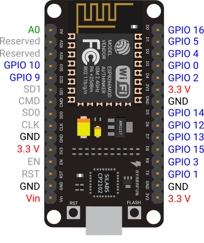

## Aula 9 - Projetos com alimentação externa.

## Conteúdo

Nessa aula falaremos um pouco sobre projetos com alimentação externa e daremos uma Introdução ao esp8266, que usaremos no projeto da tranca.

Nas aula 3 falamos sobre uma coisa chamada referencia, devemos nos lembrar de ter sempre todos nossos grounds conectados juntos para ter a mesma referencia do que eh 0v.

Quando temos um projeto que depende de uma alimentação externa, seja ela por uma fonte ou ate mesmo direto na tomada, precisamos de algo para usar como interuptor para controlar quando ligar ou desligar o que quisermos controlar.
Para fazer isso podemos utilizar reles e transistores, rele eh um dispositivo eletromecanico que ao energizar um lado ele fecha o cirucito como se fosse um interuptor normal. O transistor funciona de maneira eletronica, mas nao falaremos dele.

Um rele pode ter varios canais, que sao entradas para conectar dispositivos que queremos ligar. No exemplo usaremos um rele 5v de 1 canal.

Para conectar do lado do arduino, o `+` vai no 5v, o `-` no gnd, e o `S` vai em qualquer pino digital.
No exemplo vamos abrir e fechar a fechadura solenoide, o gnd do solenoide vai direto no gnd da fonte de alimentação externa, a parte positiva da fonte vai no bourne do meio `COM` ou `VCC`, agora  temos duas opcoes para ligar nossa fechadura, de um lado temos `NC` e do outro `NO`.
Quando escolhemos `NO - Normally Open` o cirucito so sera energizado ao enviar 5v para o pino `S`, se escolhermos `NC - Normally Closed` sera ao contrario. Como queremos nossa fechadura fechada ate que mandemos ela abrir vamos escolher o `NO`.


### Implementando no esp8266

A pinagem no esp8266 eh um pouco diferente, vou deixar abaixo uma imagem com referencia dos pinos:



No caso estamos usando o pino d4, que na verdade eh o pino GPIO 2, que declaramos abaixo, o gnd nao tem diferenca, e para alimentar os 5v do rele usamos o pino Vin que tem a mesma tensao de entrada da placa, que por padrao de usb temos 5v.

snipet:

```cpp
#define RELE 2

void abre() {
  Serial.println("Abrindo");
  digitalWrite(RELE, HIGH);
}

void fecha() {
  Serial.println("Fechando");
  digitalWrite(RELE, LOW);
}

void setup() {
  pinMode(RELE, OUTPUT);
  digitalWrite(RELE, LOW);
  Serial.begin(9600);
}

void loop() {
  abre();
  delay(1000);

  fecha();
  delay(1000);
}
```

Atencao, muito cuidado ao lidar com fontes de tensao externas, mesmo que seja baixa tensao. Sempre desligue tudo antes de trocar conexoes, e sempre faca tudo com seguranca!

## Desafio

### User history

Para finalizar o projeto da horta voce deve implementar a solenoide que irrigara de fato nosso jardim, ative a solenoide utilizando um rele ligado a uma fonte de 12v.

### Tasklist

* [ ] Implementar rele.

* [ ] Refatorar codigo e revisar com o grupo.

* [ ] Abrir pull request no github com as alteracoes de hoje para o professor revisar.


## Referências e recursos úteis

[ESP8266 pinout](https://mechatronicsblog.com/esp8266-nodemcu-pinout-for-arduino-ide/)
[Tutorial de rele](https://blogmasterwalkershop.com.br/arduino/como-usar-com-arduino-modulo-rele-5v-1-canal/)
