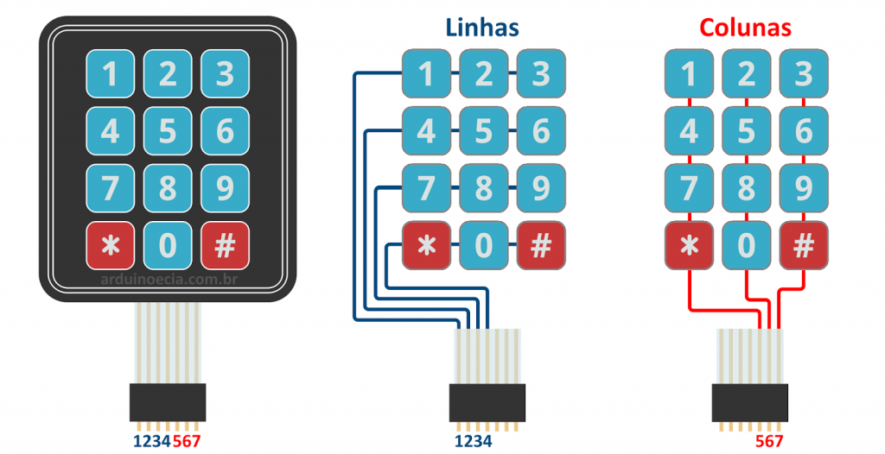

## Aula 10 - Arrays e estruturas de dados.

## Conteúdo

Nessa aula vamos falar um pouco sobre as estruturas de dados e algumas construcoes especificas do C/CPP. Mas o que eh uma estrutura de dados?
Uma estrutura de dados, como o nome diz, eh uma maneira de organizar informacoes de maneira estruturada. Os principais tipos de dados em C/CPP sao:

* Stack: Uma pilha, ou stack, coloca um item em cima do outro e ela usa o algoritimo FILO(first in, last out) ou seja para tirar o primeiro item da pilha temos que retirar os outros antes.

* Queues: Uma fila, diferente de uma pilha, trabalha com a ideia de FIFO(first in, first out) ou seja, o primeiro a entrar na fila eh sempre o primeiro a sair dela.

* Linked lists: As listas ligadas funcionam como caixas ligadas que so conhecem a caixa a sua frente, ou seja, cada item da lista contem um valor e um ponteiro(que guarda um endereco na memoria) do endereco do proximo item. E o ultimo item deve apontar para `NULL`, para indicar o final da lista, mas ela tambem pode apontar para o primeiro e ser uma lista circular.

Tambem temos diversos outros tipos de estruturas de dados, alguns que nao sao implementados em C/CPP mas podem ser feitos na mao, ou existe alguma lib para implementar, como eh o caso de `hashing tables`, `grafos`, `arvores binarias`, etc.
Nessa aula focaremos em arrays e matrizes, e falaremos um pouco sobre structs.

### Arrays

Uma array ou vetor, como eh chamado em portugues, eh uma estrutura que guarda uma cadeia de itens, ou seja, eh uma variavel que guarda varios valores. Esses valores sao armazenados em `indices` diferentes, para declarar uma array usamos a seguinte sintaxe:

```cpp
tipo nome[tamanho];
```

imagine uma lista de numeros, com 5 itens, podemos declarar assim:

```cpp
int numeros[5] = {10, 20, 30, 40, 50};
```

Ou ate mesmo assim:

```cpp
int numeros[] = {10, 20, 30, 40, 50};
```

Como colocamos um numero exato de itens na inicializacao ele ja entende que sao 5.

Para acessar o numero 10 temos que pegar o primeiro indice da array, que sempre comeca no 0.

```cpp
numero[0];
```

Podemos tambem mudar qualquer elemento da array:

```cpp
numero[0] = 100;
Serial.println(numero);
// > 100
```

Dicas uteis quando mexer com arrays:

* Lembre que elas sempre comecam no indice 0

* O indice -1 pega o ultimo item da array

* Caso queira saber o tamanho de uma array use o metodo sizeof(array)

### Matrizes

Matrizes sao arrays bidimensionais, ou seja, vetores de vetores. Usaremos esse tipo de estrutura de dados para implementar nosso teclado, que nada mais eh do que uma matriz. Por isso o nome, teclado matricial.

Declaramos uma matriz informando o numero de linhas e colunas:


```CPP
char matriz[qtd_linhas][qtd_colunas] = {
  {'1', '2', '3'},
  {'4', '5', '6'},
  {'7', '8', '9'},
  {'*', '0', '#'}
};
```

Para acessar o numero 5 do exemplo acima precisamos ir na segunda linha e na segunda coluna.

```cpp
matriz[1][1];
```

### Structs

Structs sao construcoes do C para permitir que voce crie suas proprias estruturas de dados contendo varios outros tipos dentro, imagine que queiramos armazenar informacoes sobre uma pessoa, nao podemos guardar nome e idade na mesma variavel pois sao de tipos diferentes. Entao vamos usar um struct para isso:


```CPP
typedef struct // define um novo tipo que vamos criar agora
{
    String nome; // define o atributo nome
    int idade;    // define o atributo Idade
} Pessoa; // Define o nome do novo tipo como pessoa
```

Para quem ja programa em alguma linguagem orientada a objetos deve ter percebido como isso se parece com uma classe, eh como se pudessemos criar uma classe simples(sem alguns recursos que uma classe de fato tem).

Podemos agora manipular nossa estrutura nova assim:

```CPP
Pessoa Fulano;

Fulano.nome = "Fulano Cicrano";
Fulano.idade = 42;

Fulano.idade
// 42

Fulano.nome
// Fulano Cicrano
```

### Na pratica

Para implementar esse teclado temos varias possibilidades diferentes, podemos usar uma lib, ou podemos implementar toda a logica na mao. Para simplificar usaremos a lib `Keypad`, mas caso nao usassemos, poderiamos iterar todos os itens da matriz e ver qual linha e qual coluna estao apertadas, poderiamos usar um monte de if's com varias combinacoes, ou o que seria a solucao mais correta, seria usar um interuptor. Que eh uma acao que para o processamento atual e inicia outra rotina. Porem isso eh um pouquinho mais complicado, entao vamos nos ater na matriz por enquanto.


Imagem do teclado:




## Desafio

### User history

Altere o codigo aprendido na aula de hoje para ler uma senha de 4 digitos e comparar com uma senha padrao `1234`. O programa deve autorizar ou nao o acesso.

### Tasklist

* [ ] Escrever programa para validar senha digitada no teclado pelo usuario.

* [ ] Caso esteja autorizado abra a solenoide da fechadura.

## Referências e recursos úteis

[Linked list](https://en.wikipedia.org/wiki/Linked_list)
[Tutorial de arrays multidimensionais](https://www.tutorialspoint.com/arduino/arduino_multi_dimensional_arrays.htm)
[Structs](http://www.cplusplus.com/doc/tutorial/structures/)
[Explicacao de todas estruturas de dados](https://www.geeksforgeeks.org/data-structures/)
[Tutorial keypad matricial](https://www.arduinoecia.com.br/teclado-matricial-membrana-4x3-arduino/)
