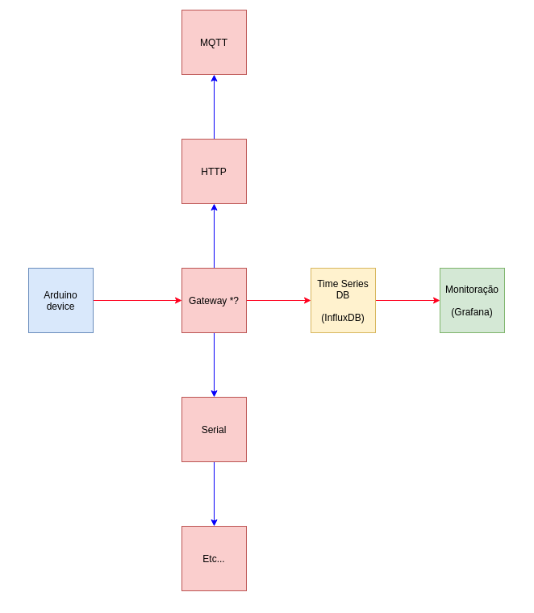

# Aula 1 - Integrando nosso Gadget.

## Conteúdo

### Retrô do semestre passado:

No último semestre, aprendemos como criar um dispositivo físico, utilizando placas de desenvolvimento como: arduino, esp8266, sensores e atuadores. Com o objetivo principal de coletar métricas, mesmo que em algumas situações nós apenas quiséssemos ativar algum LED ou motor, podemos considerar que o "ouro do IOT" (como muitos dizem), são as métricas coletadas por sensores.

### O que faremos neste semestre:

Esse semestre levaremos nosso dispositivo a outro patamar. Faremos integrações com outras tecnologias e serviços, para que assim possamos, principalmente, analisar esses dados, armazenando-os de maneira íntegra e com maior precisão temporal, além de desenvolver um sistema geração de alertas, como e-mail, SMS, mensagem no slack, etc.

Dispomos de diversas ferramentas quando nos referimos a IOT e, com isso, existem várias stacks que podem ser criadas. Porém, neste estudo, tentaremos criar uma infraestrutura baseada em containers, onde teremos um serviço para o recebimento dos dados, outro para o banco onde esses dados serão armazenados, além de um terceiro serviço que consumirá esses dados, gerando assim os gráficos e alertas que necessitaremos.

No que diz respeito à etapa responsável por receber os dados em questão, veremos algumas alternativas para desenvolver esta parte, como fazendo este recebimento dos dados acontecer via porta serial, por HTTP ou outro protocolo. A ideia é ilustrar como poderemos chegar ao mesmo objetivo final de diversas maneiras diferentes.

### Cloud VS Fog VS Edge

Quando lidamos com o processamento de métricas, existem algumas abordagens arquiteturais que podemos realizar, sendo a mais simples e conhecida delas o envio dos dados dos sensores diretamente para a cloud, para que essas métricas sejam processadas todas lá. O problema dessa abordagem, porém, é a quantia absurda de tráfego de rede com a qual teremos que lidar, além de possíveis gargalos no servidor (tornando também a segurança um risco, uma vez que transitamos mais dados pela WAN). Em resposta a isso, nasceram duas abordagens que procuram trazer esse processamento de dados para mais perto dos sensores. Esses modelos são: o FOG e o EDGE.

Neste ponto, o segredo é entender aonde iremos processar nossos dados, sabendo que, com essa escolha, impactaremos consideravelmente a arquitetura a ser definida. Quando nos referimos a EDGE e FOG, sabemos que a ideia é trazer o processamento para mais perto da coleta de métricas, porém... O que diferencia um do outro?

Quando falamos de EDGE Computing, temos sensores conectados diretamente ao dispositivo e que farão o processamento das métricas. A ideia é que ele atue como um filtro: processando as métricas e levando ao cloud apenas informações que são relevantes, trazendo dessa forma mais segurança, já que não teremos mais aquela grande quantidade de dados transitando de maneira crua. Podemos tratá-los no EDGE e enviá-los para o cloud.

Abaixo, podemos exemplificar esse modelo da seguinte forma:

* Ex1 - Um ESP32/8266 coleta métricas, as filtra e, em casos de alertas, envia um request para uma API.

* Ex2 - Um arduino uno coleta métricas, as envia por serial para um raspberry (que, por sua vez, processa as métricas) e, em casos de alertas, envia um request para uma API.

Observem que, em ambos os casos, temos os sensores diretamente ligados nos dispositivos intermediários. Porém, você deve estar se perguntando: O que acontece quando não consigo ligar o sensor diretamente nele?

Bem, nesse caso, podemos fazer uma FOG Network. A ideia básica de FOG, é que se trata de dispositivos na mesma LAN trocando métricas, realizando essa filtragem e o armazenamento de algumas métricas relevantes. A vantagem de usar uma rede FOG, é que podemos estar fisicamente mais distantes e, ainda assim, dispor dessa conexão. Um exemplo de protocolo muito utilizado para FOG é o LoraWan.

Esse cenário de FOG poderia ser descrito da seguinte forma:

* Ex1:

    * A – “Device A” coleta métricas de temperatura e, caso a temperatura ultrapasse os 50 graus, comunica-se com outro dispositivo na rede para fazer a verificação do nível de CO2.

    * B – “Device B” mede os níveis de CO 2 e, caso ele receba um request do “Device A”, compara as métricas e verifica se há muito CO 2 e muito calor, podendo indicar um incêndio. Caso se trate de fato de um incêndio, ele acionará o “Device C”.

    * C - O “Device C”, por controlar os sprinklers do prédio, receberá o aviso de incêndio e os ativará.

Com essa abordagem, garantiremos uma resposta rápida e com baixa latência, visto que essas métricas não tiveram sequer que sair da minha rede para serem processadas. Em um exemplo como o que vimos acima, essa pequena diferença de nanosegundos no processamento pode salvar uma vida.

### O que vamos precisar?

Não se preocupe caso você não tenha um rasp, mas, se possível, tenha uma máquina com Linux e faça um dualboot, ou uma máquina virtual com alguma distribuição “mais amigável” (como debian ou ubuntu, pois usaremos alguns recursos que estarão apenas disponíveis nesse SO).

Também precisamos ajustar nossos projetos, para o correto envio das métricas e o correto recebimento do outro lado, mesmo que isso varie dependendo da técnica que formos utilizar. Nossa primeira implementação será enviando dados pela porta serial, já que fizemos bastante isso durante o semestre passado.

Versão atualizada do pet feeder:

https://github.com/the-harry/pet_feeder/tree/v_2

Versão atualizada do smart garden:

https://github.com/the-harry/smart_garden/tree/v_2

## Referências e recursos úteis

[InfluxDB](https://www.influxdata.com/)
[Grafana](https://grafana.com/)
[Docker](https://www.docker.com/)
[rfc 7231 - protocolo HTTP](https://tools.ietf.org/html/rfc7231)
[MQTT](https://mqtt.org/)
[Raspberry](https://www.raspberrypi.org/)
[OpenFog Reference Architecture for Fog Computing](https://www.iiconsortium.org/pdf/OpenFog_Reference_Architecture_2_09_17.pdf)
[Fog definition](https://internetofthingsagenda.techtarget.com/definition/fog-computing-fogging)
