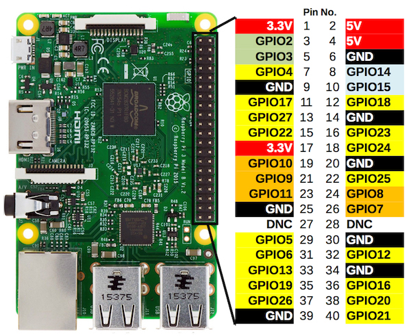

# Aula 2 - Configuração inicial do rasp e comandos linux basicos.

## Conteúdo

Nessa aula veremos a configuração inicial do raspberry pi e alguns comandos úteis.

Após instalar a ISO no sdcard, abra ele no seu computador e crie um arquivo em branco com o nome `ssh`(sem extenção), ele vai habilitar o ssh, e crie outro arquivo chamado `wpa_supplicant.conf` e use o modelo abaixo com sua wifi:

```
country=BR
ctrl_interface=DIR=/var/run/wpa_supplicant GROUP=netdev
update_config=1

network={
  scan_ssid=1
  ssid="NOME_DA_REDE"
  psk="SENHA_DA_REDE"
}
```

Agora vamos ligar e acessa-lo. Com um teclado e um monitor ligados no rasp. Após se logar com o usuário padão `pi:raspberry`, se conecte a internet(por cabo ou wifi) e abra um terminal. Nós poderiamos fazer tudo por aqui, mas por comodidade vamos apenas pegar o endereço de ip, e habilitar o ssh para nos conectarmos remotamente.
Para começar digite o comando `ip a` para verificar seu ip, caso tenha se conectado por wifi a interface associada será algo como `wlp6s0 ou wlan0` se for por cabo será algo como `enp12s0 ou eth0`, anote esse ip.

Agora que temos o endereço de ip e habilitamos o ssh podemos nos conectar assim daqui para frente, sem a necessidade de plugar mil coisas no rasp. Supondo que seu ip seja `192.168.0.13` digite no seu pc/note digite:

- OBS: Caso use linux é bem provavel que ele já tenha ssh, mas se você usa windows ~~deveria usar linux~~ pode usar o Putty,

`ssh pi@192.168.0.13`

Após colocar a senha já estará logado e podemos continuar a configuração.
Digite o comando [sudo raspi-config](https://www.raspberrypi.org/documentation/configuration/raspi-config.md) para configurarmos nosso terminal. A maior parte das opções disponíveis nessa ferramenta são possíveis de se configurar "na mão", mas o `raspi-config` nos provê uma interface facilitada para isso.
Você pode navegar no menu que abrirá usando as setas, enter e esc. Temos as seguintes opções:

```
│        1 Change User Password     Alterar senha do usuário
│        2 Network Options          Configurações de rede
│        3 Boot Options             Configurações de boot
│        4 Localisation Options     Configurações regionais de data, hora e idioma
│        5 Interfacing Options      Configurações de interfaces e periféricos
│        6 Overclock                O nome já diz...
│        7 Advanced Options         Configurações avançadas
│        8 Update                   Faz um update
│        9 About raspi-config       Mostra uma ajuda sobre o raspi-config
```

Ao iniciar seu raspi a primeira vez é legal alterar a senha(ou criar outro usuário), configurar o acesso a rede, colocar os locales corretos caso não estejam, mudar o hostname e fazer um update. Vamos relembrar alguns comandos de linux que nos ajudarão no dia-a-dia:

OBS: Comandos com o prefixo `$` podem ser rodados por usuários normais, e comandos prefixados com `#` devem ser executados como root.

* Navegar entre pastas(dica: aperte tab para ver os caminhos disponíveis da sua pasta atual):
`$ cd /caminho/x`

* Verificar o endereço IP, MAC e outras informações de interfaces
  `$ ip a`

* Virar root:
  `$ sudo -i`

* Atualizar source lists e pacotes:
  `# apt update && apt upgrade`

* Conexão por SSH por senha:
  `$ ssh user@host_ou_ip`

* Gerenciar serviços:

  - Verificar o status
    `# systemctl status nome_do_serviço`
  - Iniciar o serviço
    `# systemctl start nome_do_serviço`
  - Parar o serviço    
    `# systemctl stop nome_do_serviço`
  - Habilita o serviço na inicialização do sistema operacional
    `# systemctl enable nome_do_serviço`
  - Desabilita o serviço na inicialização do sistema operacional
    `# systemctl disable nome_do_serviço`

* Caso queira ver processos associados a alguma porta use o ss:
  `# ss -tupln`

* Não sabe o que o comando faz? Dê uma olhada no manual:
`$ man nome_do_comando`

## Outras features do rasp

O Raspberry ja vem com algumas outras coisas legais, como bluetooth, conexoes para displays e camera, e também os 40 GPIOs(general-purpose input/output) disponíveis para conectar sensores e modulos.
Um ponto bacana disso eh poder usar python no lugar de C++, porem muitas nao eh preciso, ja que para coisas simples na maioria das vezes, um arduino ja pode resolver seu problema.



## Desafio

### User story

Na segunda semana você foi incubido de configurar o raspberry junto com a Jane, para prosseguir com a fase de desenvolvimento.

### Tasklist

* [ ] Configurar hostname

* [ ] Alterar boot para iniciar com o CLI pedindo logins

* [ ] Atualizar sistema

* [ ] Alterar a senha

* [ ] Configurar locales(data, hora, teclado)

## Referências e recursos úteis

[Pagina oficial do Raspberry pi](https://www.raspberrypi.org/)
[Download Raspian image](https://www.raspberrypi.org/downloads/)
[Documentacao sobre GPIO](https://www.raspberrypi.org/documentation/usage/gpio/)
[raspi-config](https://www.raspberrypi.org/documentation/configuration/raspi-config.md)
