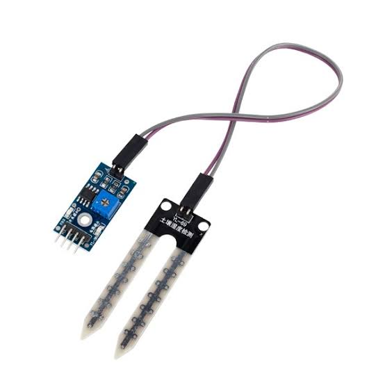
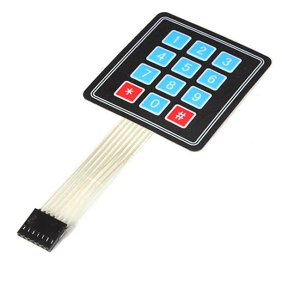
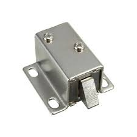
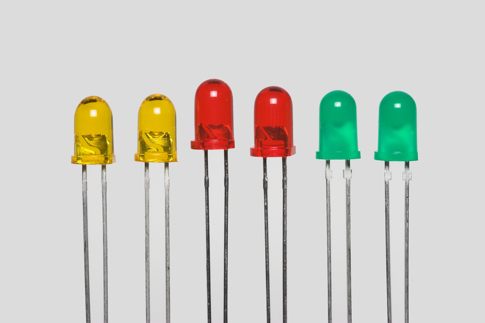

# Material IOT 2020

## Estrutura das aulas
Esse material tem como objetivo simular um ambiente de trabalho de desenvolvimento real, ou o mais proximo possivel. As quatro primeiras aulas serao bases teoricas que precisam ser passadas, porem todas as outras aulas serao praticas.

Nessas aulas praticas sempre tera uma parte teorica que tera o mesmo que foi explicado na aula, um user history que eh basicamente um caso de contando uma historia que tem como objetivo trazer uma problematica para que seja resolvida, e no final teremos alguns desafios praticos. Caso queira consultar posteriormente o conteudo da aula basta ir ate a pasta da aula em especifico.

Cada aula vai estar em uma pasta seguindo o padrão `semestre/aula` ter um ou mais código(s)/arquivo(s) de exêmplo, e também um `README.md` onde terão instruções da aula.

O READMEs sao escritos em [markdown](https://github.com/adam-p/markdown-here/wiki/Markdown-Cheatsheet), que eh muito usado para criar documentacoes de projetos. Todas as aulas estaram nesse repositorio do github. Para acompanhar as aulas voce pode baixar ou clonar o projeto, ou simplesmente usar o navegador para visitar as aulas e ver os arquivos de exemplo.

Durante os dois semestres serão feitos alguns projetos para exemplificar os conceitos aprendidos de maneira pratica. A historia base do projeto eh a seguinte:

Voce acaba de ser contratado pela ACME Corporation, no departamento de IOT e inovacao. No seu time temos algumas funcoes principais, temos o desenvolvedor, que faz os codigos das solucoes, temos tambem um Sysadmin que eh responsavel por cuidar de toda infraestrutura, e servicos utilizados pelo time, e temos um engenheiro eletrico, que eh o responsavel pela parte de hardware e eletronica, todo time participa ativamente das Decisões entao nao temos uma pessoa especifica para gerenciamento do projeto, ja que todos acabam fazendo isso em coletivo.

Para esse ano algumas metas foram definidas, e a direcao da ACME fechou contrato com uma empresa para solucoes residenciais onde solicitaram a realizacao de tres projetos durante esse ano:

* `Monitoração de hortas`:
Esse projeto visa criar uma maneira de coletar dados e diminuir o disperdicio de agua coletando informacoes sobre o jardim e irrigando ele automaticamente. Os dados coletados deveram ser exibidos em graficos para o cliente final, para que possa monitorar se tudo esta conforme o imaginado.

* `Alimentador de pet`:
Para donos de animais que ficam muito tempo fora de casa, seja por trabalho, estudo ou ate mesmo viagens esse projeto possibilita uma alimentacao desses pets de maneira automatizada, alguns requesitos ficaram em abertos para que o time escolha a melhor abordagem, esse projeto pode trabalhar com uma especie de timer para criar uma rotina de alimentacao, ou ele deve ser acionado manualmente.

* `Fechadura com RFID`:
Esse projeto visa criar uma rede de seguranca entre fechaduras, a ideia eh fazer uma fechadura que possa ser aberta por senha ou RFID, e a ideia eh que funcione em conjunto com outras para criar uma rede interna que caso alguma fechadura cause uma indisponibilidade ou seja violada as outras sejam travadas automaticamente ate um segundo comando.

No primeiro mes na empresa voce tera um treinamento onde aprendera mais sobre arduino, programacao e eletronica, apos isso voce comecara esses projetos. Nossa deadline eh ate o final do ano. Precisamos no primeiro semestre criar os prototipos para no segundo comecar a integrar o resto da infraestrutura.

### Primeiro semestre

Caso não tenha um arduino pode usar o [tinkercad](https://www.tinkercad.com) para emular um.

  * `Aula 1 - Arduino, tipos, instalação da IDE.`

  * `Aula 2 - Introdução a lógica de programação.`

  * `Aula 3 - Eletronica basica.`

  * `Aula 4 - Arduino getting started.`

  * `Aula 5 - Operações lógicas - if, else, else if.` jardim

  * `Aula 6 - Controle de repetição - Loops for e while.` pet feeder

  * `Aula 7 - Funções e retornos.` pet feeder

  * `Aula 8 - Destrinchando o git.` jardim

  * `Aula 9 - Arrays e estruturas de dados.` ? petfeeder

  * `Aula 10 - Protothreading.` jardim

  * `Aula 11 - Projetos com alimentação externa.` jardim

  * `Aula 12 - Introdução ao RFID.` tranca

  * `Aula 13 - Criando uma lib.` tranca

  * `Aula 14 - Radio frequencia.` tranca

  * `Aula 15 - Mesh network.` tranca

### Segundo semestre

Caso não tenha um raspberry temos algumas maneiras de [emular um](https://www.makeuseof.com/tag/emulate-raspberry-pi-pc/)(em ingles, mas mostra tres metodos) ou apenas usando [QEMU em portugues](https://www.techtudo.com.br/dicas-e-tutoriais/noticia/2016/11/aprenda-virtualizar-o-raspberry-pi-para-testar-sistemas-e-projetos-no-pc.html).

  * `Aula 1 - Introdução ao raspberry pi e dispositivos de borda.`

  * `Aula 2 - Configuração inicial e comandos administrativos.`

  * `Aula 3 - Introdução a Python.`

  * `Aula 4 - Estrutura de dados no python.`

  * `Aula 5 - Decisões e controles de repetição no python.`

  * `Aula 6 - Funções no python.`

  * `Aula 7 - Integração Arduino e Rasp, comunicação serial.`

  * `Aula 8 - APIs e requests http.`

  * `Aula 9 - Usando o docker na infraestrutura.`

  * `Aula 10 - Time series databases, Introdução ao influx.`

  * `Aula 11 - Introdução a monitoração com Grafana.`

## Hardware

Para um melhor acompanhamento das aulas é sugerido que tenha em mão os seguintes itens, para a montagem dos protótipos em sí ainda faltará algumas peças que podem ser improvisadas facilmente, os itens a seguir serão listados pela ordem de uso nas aulas.

Nao se preocupe caso nao tenha condicoes de adquirir todos os itens, pelo menos o sificiente para usar na aula sera levado pelo professor. Caso escolha usar as solucoes virtualizadas, eh importante resaltar que temos alguns problemas de consistencia, ja que um emulador nunca tera os problemas de um hardware de verdade, problemas de tempo, conexao, entre outros. Isso nao torna as solucoes virtuais inuteis, mas tenha isso em mente quando for fazer um projeto, pode ser que no simulador ele funcione perfeitamente e ao colocar para rodar de verdade ele apresente algum problema, mas essa eh a parte divertida do debug! :)

Segue a lista dos itens usados para os projetos:

* `Arduino Uno`

* `Cabo serial (muitas impressoras usam esse cabo, talvez voce tenha em casa)`

* `Micro Servo 9g SG90 TowerPro`

* `Sensor de presença PIR DYP-ME003`

* `Sensor higrometo (umidade de solo)`

* `Sensor de umidade e temperatura - DHT11`

* `Modulo Sensor de Luz LDR`

* `Rele 5v 1 canal`

* `Solenoide para irrigação(ou um solenoide simples para testes apenas)`

* `Protoboard 830 pontos`

* `Kit RFID Sensor e cartão/tag - RFID-RC522`

* `Teclado Matricial de Membrana 12 Teclas`

* `Fechadura solenoide`

* `Leds`

  - 5 LEDs Vermelhos
  - 5 LEDs Verdes

* `Resistores`

  - 10 Resistores de 300Ω
  - 10 Resistores de 220Ω
  - 10 Resistores de 10KΩ

* `Jumpers`

  - 20 Macho / Fêmea
  - 20 Macho / Macho (ou um pedaço de cabo de rede)

* `Raspberry Pi 3+`

* `Fonte universal com varias tensoes e plugs`

O resto e so criatividade!
