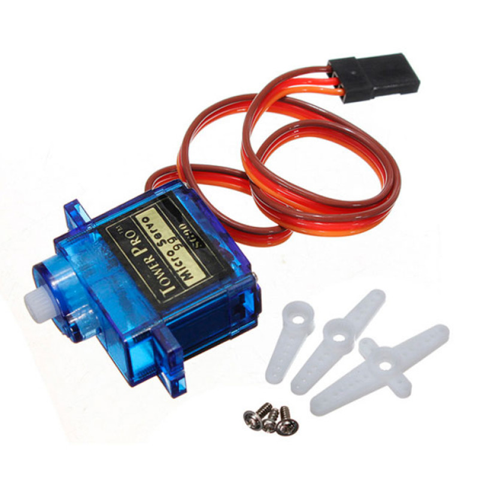
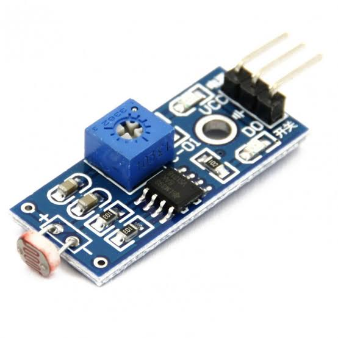
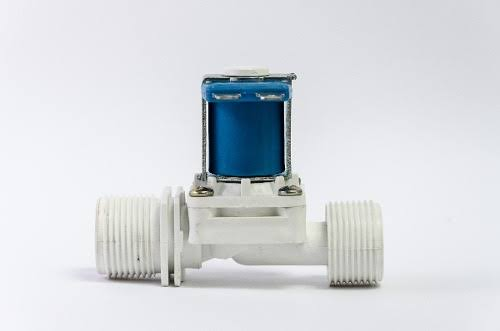
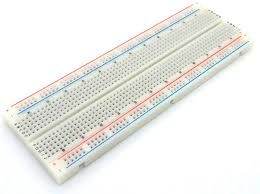

# Material IOT 2020

## Estrutura das aulas
Este material tem como objetivo simular um ambiente de trabalho de desenvolvimento real, ou o mais próximo possível deste cenário. As quatro primeiras aulas serão bases teóricas que possuem grande importância e precisam ser estudadas, sendo todas as demais aulas práticas.

As aulas práticas sempre abordarão a base teórica de um mesmo conteúdo explicado anteriormente em aula, ou seja, um User story (que se resume basicamente em um caso que, contando uma história, tem como objetivo trazer uma problemática a ser resolvida). No final destas, teremos também alguns desafios práticos. Caso queira consultar posteriormente o conteúdo já abordado em aula, basta ir até a pasta “aula em específico”.

Cada aula poderá ser encontrada em uma pasta seguindo o seguinte padrão: `semestre/aula`; apresentará um ou mais código(s)/arquivo(s) de
exemplo; e, por fim, um README.md, onde constarão as instruções da aula.

Os READMEs são arquivos escritos em  [markdown](https://github.com/adam-p/markdown-here/wiki/Markdown-Cheatsheet) , linguagem muito utilizada para criar documentações de projetos. Todas as aulas estarão presentes nesse repositório do github. Para acompanhar as aulas, você pode baixar ou clonar o projeto, ou simplesmente usar o navegador para visitar as aulas e acessar os arquivos de exemplo.

Durante os dois semestres serão realizados alguns projetos, desenvolvidos para exemplificar os conceitos aprendidos de maneira prática.

Segue abaixo a história base deste projeto:

Você acaba de ser contratado pela ACME Corporation. No departamento em que atuará, de IOT e inovação, o seu time possui algumas funções principais, sendo elas: desenvolvedor, responsável por desenvolver os códigos das soluções; Sysadmin, responsável por cuidar de toda a infraestrutura e serviços utilizados pelo time; e engenheiro elétrico, responsável por toda a parte de hardware e eletrônica.

Como todo o time, citado anteriormente, participa ativamente das decisões, não existe uma pessoa que exerça a função específica de gerenciar o projeto.

Para este ano, algumas metas foram definidas, e a direção da ACME fechou contrato com uma empresa para soluções residenciais. Pela empresa contratada, foi solicitada a realização de três projetos durante o ano em questão:

* `Monitoramento de hortas`:
Esse projeto visa criar uma maneira de coletar dados e diminuir o desperdício de água, colhendo informações sobre o jardim e irrigando-o automaticamente. Os dados coletados deverão ser exibidos em gráficos para o cliente final, para que este possa acompanhar se tudo está se desenvolvendo conforme o esperado.

* `Alimentador de pet`:
Para os donos de animais que ficam muito tempo fora de casa, seja por motivo de trabalho, estudo ou até mesmo viagens, esse projeto possibilita a estes pets o acesso a uma alimentação automatizada. Alguns requisitos sobre a abordagem ficarão em aberto para que os membros do time façam juntos a melhor escolha. Uma sugestão para este projeto é trabalhar com uma espécie de timer para criar uma rotina de alimentação para os animais, podendo ou não ser acionado manualmente.

* `Fechadura com RFID`:
Este projeto visa criar uma rede de segurança entre fechaduras. A ideia é desenvolver uma fechadura que possa ser aberta por senha ou RFID, e que funcione em conjunto com outras do mesmo tipo. Desta forma, as chaves criarão uma rede interna que, em caso de falha, indisponibilidade ou violação de alguma das fechaduras, possa levar ao travamento automático das demais, até que um segundo comando seja dado.

No primeiro mês na empresa, você terá um treinamento onde aprenderá mais sobre arduino, programação e eletrônica. Após esta etapa, você começará a dar vida a estes projetos. Nossa deadline é até o final do ano.
Precisamos no primeiro semestre criar os protótipos para, no segundo, começar a integrar o restante da infraestrutura.

### Primeiro semestre

Caso não possua um Arduino, você pode usar o [tinkercad](https://www.tinkercad.com) para emular um.

  * `Aula 1 - Arduino, tipos, instalação da IDE.`

  * `Aula 2 - Introdução à lógica da programação.`

  * `Aula 3 - Eletrônica básica.`

  * `Aula 4 - Arduino getting started.`

  * `Aula 5 - Operações lógicas - if, else, else if.`

  * `Aula 6 - Controle de repetição - Loops for e while.`

  * `Aula 7 - Funções e retornos.`

  * `Aula 8 - Destrinchando o git.`

  * `Aula 9 - Projetos com alimentação externa.`

  * `Aula 10 - Arrays e estruturas de dados.`

  * `Aula 11 - Comunicação por HTTP.`

  * `Aula 12 - Introdução ao RFID.`

### Segundo semestre

Caso não tenha um raspberry, temos algumas maneiras de [emular um](https://www.makeuseof.com/tag/emulate-raspberry-pi-pc/)(em inglês, mas mostra três métodos) ou apenas usando [QEMU em portugues](https://www.techtudo.com.br/dicas-e-tutoriais/noticia/2016/11/aprenda-virtualizar-o-raspberry-pi-para-testar-sistemas-e-projetos-no-pc.html).

  * `Aula 1 - Integrando nosso gadget.`

  * `Aula 2 - Configuração inicial do rasp e comandos linux basicos.`

  * `Aula 3 - Python 101.`

  * `Aula 4 - Integração Arduino e Rasp, comunicação serial.`

  * `Aula 5 - Protocolo HTTP.`

  * `Aula 6 - Criando uma API.`

  * `Aula 7 - Usando o docker no projeto.`

  * `Aula 8 - Time series databases, Introdução ao InfluxDB.`

  * `Aula 9 - Introdução à monitoração com Grafana.`

  * `Aula 10 - Trabalhando com alertas.`

  * `Aula 11 - Protocolo MQTT.`

  * `Aula 12 - Protocolo BLE.`

## Hardware

Para um melhor acompanhamento das aulas, é sugerido que tenha em mãos os itens listados abaixo. Para a montagem dos protótipos em si, ainda faltarão algumas peças, que podem ser facilmente improvisadas. Os itens a seguir serão listados pela ordem em que serão utilizados nas aulas.

Não se preocupe caso não tenha condições de adquirir todos os itens, pois pelo menos os essenciais, para serem utilizados em aula, serão levados pelo professor. Caso escolha usar as soluções virtualizadas, é importante ressaltar que temos alguns problemas de consistência, já que um emulador nunca apresentará os mesmos problemas de um hardware de verdade, tais como: problemas de tempo, de conexão, entre outros. Isso não torna as soluções virtuais inúteis, mas é importante ter isso em mente quando for desenvolver um projeto. Pode ser que no simulador ele funcione perfeitamente e, ao colocar para rodar de verdade, ele apresente algum problema. De qualquer forma, essa é a parte divertida do debug! :)

Segue a lista dos itens usados para os projetos:

* `Arduino Uno`

* `Cabo serial (muitas impressoras utilizam esse cabo, por isso talvez você o tenha em casa)`

* `Micro Servo 9g SG90 TowerPro`

* `Sensor de presença PIR DYP-ME003`

* `Sensor higrômetro (umidade de solo)`

* `Sensor de umidade e temperatura - DHT11`

* `Módulo Sensor de Luz LDR`

* `Rele 5v 1 canal`

* `Solenoide para irrigação (ou um solenoide simples para testes apenas)`

* `Protoboard 830 pontos`

* `Kit RFID Sensor e cartão/tag - RFID-RC522`

* `Teclado Matricial de Membrana 12 Teclas`

* `Fechadura solenoide`

* `Leds`

  - 5 LEDs Vermelhos
  - 5 LEDs Verdes

* `Resistores`

  - 10 Resistores de 300Ω
  - 10 Resistores de 220Ω
  - 10 Resistores de 10KΩ

* `Jumpers`

  - 20 Macho / Fêmea
  - 20 Macho / Macho (ou um pedaço de cabo de rede)

* `Raspberry Pi 3+`

* `Fonte universal com várias tensões e plugs`

O resto fica por conta da criatividade!
