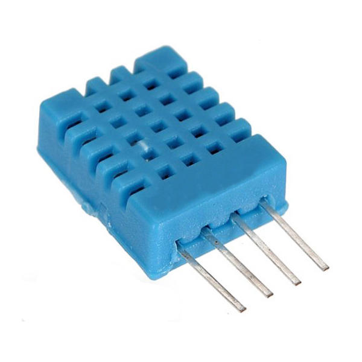
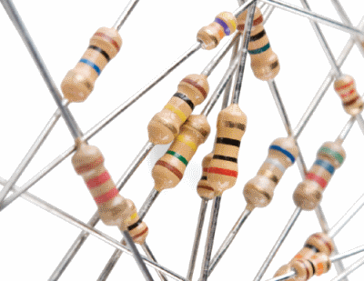
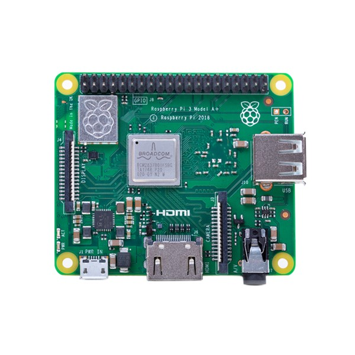

# Material IOT 2020

## Estrutura das aulas
Cada aula vai estar em uma pasta seguindo o padrão `semestre/aula` ter um código de exêmplo,
e também um `README.md` onde terão instruções de como o código funciona. No final de cada readme terá
um ou mais desafios aplicando os conceitos aprendidos.

Durante os dois semestres serão feitos alguns projetos para exemplificar os conceitos vistos na aula:

* Monitoração de hortas

* Alimentador de pet

* Fechadura com RFID

TODO - explicar papéis e criar historia
Roles:

Dev

Sysadmin

Hardware/Eletrônica

### Primeiro semestre

Caso não tenha um arduino pode usar o [tinkercad](https://www.tinkercad.com) para emular um.

  * `Aula 1 - Arduino, tipos, instalação da IDE.`

  * `Aula 2 - Introdução a lógica de programação.`

  * `Aula 3 - Análise estrutural do sketch usando o blink.`

  * `Aula 4 - Variáveis, constantes e definições.`

  * `Aula 5 - Operações lógicas - if, else, else if.`

  * `Aula 6 - Controle de repetição - Loops for e while.`

  * `Aula 7 - Funções e retornos.`

  * `Aula 8 - Destrinchando o git.`

  * `Aula 9 - Arrays e estruturas de dados.`

  * `Aula 10 - Protothreading.`

  * `Aula 11 - Projetos com alimentação externa.`

  * `Aula 12 - Introdução ao RFID.`

  * `Aula 13 - Criando uma lib.`

  * `Aula 14 - Radio frequencia.`

  * `Aula 15 - Mesh network.`

### Segundo semestre

Caso não tenha um raspberry pode usar uma máquina virtual para emular um.

  * `Aula 1 - Introdução ao raspberry pi e dispositivos de borda.`

  * `Aula 2 - Configuração inicial e comandos administrativos.`

  * `Aula 3 - Introdução a Python.`

  * `Aula 4 - Estrutura de dados no python.`

  * `Aula 5 - Decisões e controles de repetição no python.`

  * `Aula 6 - Funções no python.`

  * `Aula 7 - Integração Arduino e Rasp, comunicação serial.`

  * `Aula 8 - APIs e requests http.`

  * `Aula 9 - Usando o docker na infraestrutura.`

  * `Aula 10 - Time series databases, Introdução ao influx.`

  * `Aula 11 - Introdução a monitoração com Grafana.`

## Hardware

Para um melhor acompanhamento das aulas é sugerido que tenha em mão os seguintes itens, para a montagem dos protótipos em sí ainda faltará algumas peças que podem ser improvisadas facilmente, os itens a seguir serão listados pela ordem de uso nas aulas, segue a lista:

* `Arduino Uno`

* `Cabo serial para arduino`

* `Micro Servo 9g SG90 TowerPro`

* `Sensor de presença PIR DYP-ME003`

* `Sensor de umidade de solo`

* `Sensor de umidade e temperatura - DHT11`

* `Modulo Sensor de Luz LDR`

* `Solenoide para irrigação(ou um solenoide simples para testes apenas)`

* `Protoboard 830 pontos`

* `Kit RFID Sensor e cartão/tag - RFID-RC522`

* `Teclado Matricial de Membrana 12 Teclas`

* `Leds`

  - 5 LEDs Vermelhos
  - 5 LEDs Verdes

* `Resistores`

  - 10 Resistores de 300Ω
  - 10 Resistores de 220Ω
  - 10 Resistores de 10KΩ

* `Jumpers`

  - 20 Macho / Fêmea
  - 20 Macho / Macho (ou um pedaço de cabo de rede)

* `Raspberry Pi 3+ OU USAR MÁQUINA VITUAL(tem certas limitações)`

* `Fonte bivolt 9V/1A com plug P4 - OPCIONAL`

